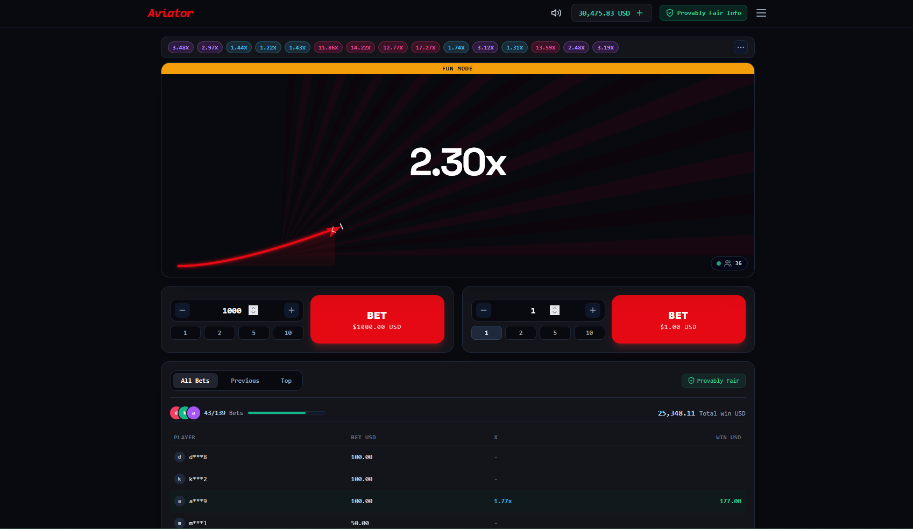
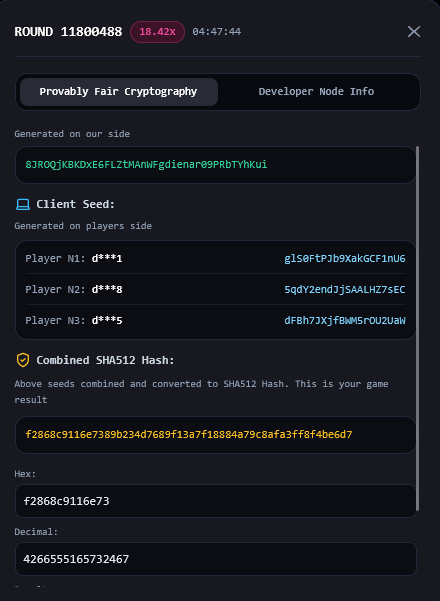
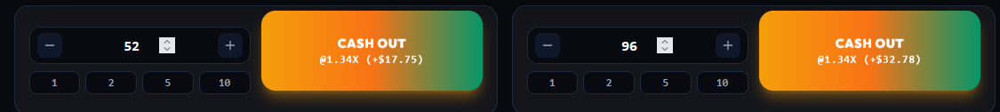
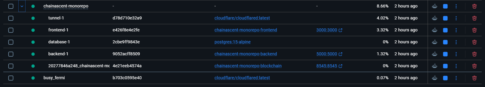
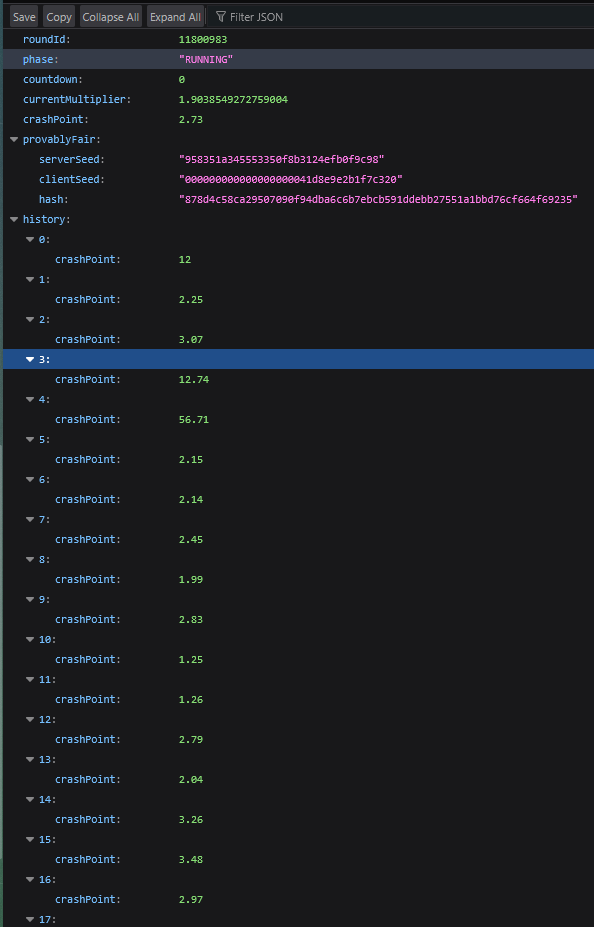

<div align="center">


<br/>

> **A containerized 5-tier Web3 Aviator-style crash game ecosystem featuring provably fair cryptographic verification and smart contract payout execution.**  
> Built with Next.js 14, Express API, PostgreSQL 15, and Solidity on Hardhat EVM.

<br/>

[](http://localhost:3000/)
[](http://localhost:5000/api/game/status)
[](http://localhost:8545)

</div>

---

## 📸 Screenshots

### 🎮 Live Aviator Flight Engine — 60 FPS HTML5 Canvas


### 🔒 Provably Fair Cryptographic Inspector & SHA512 Verification


### ⚡ Dual Independent Betting Control Panels


### 📋 Docker Microservices Ecosystem (Console Logs)


### 🌐 Backend Express REST API & PostgreSQL Health


---

## ⚡ What It Does

ChainAscent is a production-grade 5-tier Web3 Aviator crash game monorepo. Players place bets before round launch while an airplane ascends, increasing a multiplier in real-time. Players must cash out before the plane crashes to multiply their stake.

| Metric / Feature | Result / Details |
|------------------|------------------|
| 🎮 Game Mechanics | 60+ FPS HTML5 Canvas flight path rendering with particle explosions |
| 🔑 Provably Fair Engine | HMAC-SHA512 & SHA256 cryptographic multiplier pre-determination |
| 💰 Dual Betting Panels | Place 2 independent bets per round with preset amount pills ($1, $2, $5, $10) |
| 🎵 Audio Synthesizer | Native Web Audio API (`AudioContext`) sound synthesis for flight & crashes |
| ⛓️ Smart Contract | Solidity 0.8.20 (`MultiplierGame.sol`) with CEI reentrancy protection |
| 🐳 Deployment | 1-command `docker compose up --build -d` orchestrating 5 containerized tiers |

---

## 🏗️ Architecture

```
                       User Browser (Web3 Frontend)
                                   │
                                   ▼
                    [Next.js 14 Frontend - Port 3000]
                    ┌───────────────────────────────┐
                    │ • HTML5 Canvas Flight Engine  │
                    │ • Web Audio Synthesizer       │
                    │ • Provably Fair Inspector     │
                    └───────┬───────────────┬───────┘
                            │               │
            REST API (Port 5000)            │ JSON-RPC (Port 8545)
                            │               │
                            ▼               ▼
         [Express Backend - Port 5000]   [Hardhat EVM - Port 8545]
         ┌───────────────────────────┐   ┌──────────────────────┐
         │ • Game Orchestrator Loop  │   │ • MultiplierGame.sol │
         │ • Provably Fair HMAC-SHA  │   │ • CEI Payout Guard   │
         └─────────────┬─────────────┘   └──────────────────────┘
                       │
               SQL Pool (Port 5432)
                       │
                       ▼
        [PostgreSQL DB - Port 5432]
        ┌───────────────────────────┐
        │ • `games` & `bets` Tables │
        │ • Persistent Volume Data  │
        └───────────────────────────┘
```

---

## 🛠️ Tech Stack

| Layer | Technology |
|-------|-----------|
| 🎨 Frontend | Next.js 14 (App Router), React 18, HTML5 Canvas, Tailwind CSS, Web Audio API |
| 🐍 Backend API | Express.js, Node.js, Crypto (HMAC-SHA512 / SHA256) |
| ⛓️ Blockchain | Solidity `^0.8.20`, Hardhat EVM, Ethers.js |
| 🐘 Database | PostgreSQL 15 (Alpine) with connection retry resilience |
| 🐳 Containerization | Docker & Docker Compose (5-tier microservices network) |
| 🌐 Tunneling | Cloudflare Tunnels / localtunnel / ngrok remote access |

---

## ✈️ Core Subsystems

### 🎨 HTML5 Canvas Flight Engine
Uses `requestAnimationFrame` for 60+ FPS smooth rendering. Displays sunburst background rays, quadratic curved flight trajectories, dynamic airplane sprites, glowing trails, and explosive crash particle effects. Includes a top Multiplier History Ribbon showing recent outcomes.

### 🔐 Provably Fair Cryptographic Engine
Calculates crash multipliers deterministically before round start using HMAC-SHA512 / SHA256. Players can open the built-in inspector modal to independently verify server seeds, client seeds, combined hashes, and exact multipliers.

### 💰 Dual Betting Controls & Audio Synthesizer
Allows users to configure two autonomous betting panels simultaneously. Features live profit displays, automated cashout options, and custom procedural sound effects generated directly via the browser Web Audio API.

### ⛓️ Solidity Smart Contract (`MultiplierGame.sol`)
Enforces minimum and maximum bet constraints, manages on-chain state, and executes payouts safely using Checks-Effects-Interactions (CEI) design patterns to prevent reentrancy attacks.

---

## 📁 Project Structure

```
ChainAscent/
├── backend/                  # Express.js REST API server & provably fair engine
│   ├── index.js              # Game loop, API routes & PostgreSQL pool
│   ├── package.json
│   └── Dockerfile
├── frontend/                 # Next.js 14 Spribe-style Aviator Web Application
│   ├── src/
│   │   ├── app/              # App router & layout
│   │   ├── components/       # MultiplierCanvas, BettingPanel, ProvablyFairModal
│   │   └── utils/            # Web Audio engine & helpers
│   ├── package.json
│   └── Dockerfile
├── blockchain/               # Hardhat EVM & Solidity Smart Contracts
│   ├── contracts/            # MultiplierGame.sol smart contract
│   ├── scripts/              # Deployment & test scripts
│   ├── hardhat.config.js
│   └── Dockerfile
├── docker-compose.yml        # Orchestrates frontend, backend, database, blockchain, & tunnel
├── .gitignore                # Comprehensive ignore rules
└── screenshots/              # Application screenshots
```

---

## 🚀 Setup & Deployment

### 1. Clone the repository
```bash
git clone https://github.com/arham-abro/Chain-Ascent.git
cd Chain-Ascent
```

### 2. Start the full 5-tier stack with Docker Compose
```bash
docker compose up --build -d
```

### 3. Access the application
- 🎮 **Frontend Game Interface**: [http://localhost:3000](http://localhost:3000)
- ⚡ **Express REST API**: [http://localhost:5000/api/game/status](http://localhost:5000/api/game/status)
- ⛓️ **Hardhat Blockchain RPC**: [http://localhost:8545](http://localhost:8545)

> 💡 **Global Remote Access**: To access from mobile data or remote networks, run `npx localtunnel --port 3000` or `npx ngrok http 3000`.

---

## 🔍 Provably Fair Algorithm

```javascript
function generateProvablyFairRound(serverSeed, clientSeed) {
  const hash = crypto.createHmac('sha256', serverSeed).update(clientSeed).digest('hex');
  const hexSubstring = hash.substring(0, 8);
  const intVal = parseInt(hexSubstring, 16);
  const crashMultiplier = Number((1.01 + (intVal % 1400) / 100).toFixed(2));
  return { hash, crashMultiplier };
}
```

---

## 📡 API Endpoints

| Endpoint | Method | Description |
|----------|--------|-------------|
| `/health` | `GET` | Health check for Express API & PostgreSQL |
| `/api/game/status` | `GET` | Current game state, countdown, multiplier, & history |
| `/api/game/bet` | `POST` | Place a bet for the upcoming round |
| `/api/game/cashout` | `POST` | Cash out active bet at current multiplier |
| `/api/game/provably-fair` | `GET` | Retrieve provably fair seeds & hash verification data |

---

## 🎓 Project Info

| Field | Details |
|-------|---------|
| 👤 Student | Arham Abro |
| 🎫 Roll No. | 72532 |
| 📚 Course | Complex Computer Project (CCP) / Web3 / Cloud Security |
| 👨‍🏫 Instructor | Muhammad Ahsan Naeem |
| 🏛️ Department | Cyber Security — Iqra University |
| 📅 Date | September 2026 |

---

<div align="center">

**Made with 🚀 for Web3 Aviator Crash Game Monorepo**

</div>
